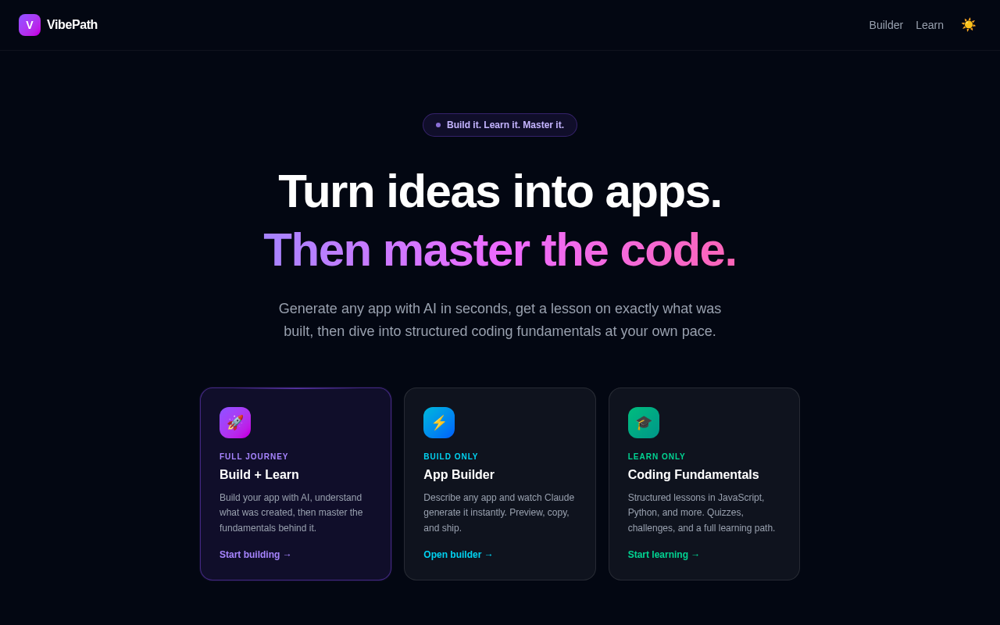

# Cycle 1 — VibePath

**Live:** [vibepath-olive.vercel.app](https://vibepath-olive.vercel.app)
**Code:** [github.com/Tatopapi3/VibePath](https://github.com/Tatopapi3/VibePath)

## Problem

AI app builders (v0, bolt.new, Lovable, etc.) can generate a working app from a
prompt in seconds — but they create a learning gap. You get code that works
without understanding *why* it works, which is exactly backwards for anyone
trying to actually get better at building software. There wasn't a tool that
let you use AI generation *and* close that gap in the same sitting.

## Solution

VibePath is a two-sided platform: an instant AI app builder, and a structured
coding curriculum — connected by a feature that turns whatever you just
generated into a lesson on the real concepts behind it.

## Key features

- **Instant AI app generation** — describe an app in plain language; Claude
  (`claude-sonnet-4-6`) streams back a complete, runnable HTML file (React +
  Tailwind, no build step) live in the browser.
- **Concept-linked lessons** — an "Explain" flow takes the app that was just
  generated and produces a lesson on the specific concepts it used, so the
  builder and the curriculum aren't two disconnected products.
- **Structured curriculum independent of the builder** — 16 JavaScript
  modules and 11 Python units, each with lessons, quizzes, and coding
  challenges, for anyone who wants to learn fundamentals without generating
  anything first.
- **Progress and rewards** — XP and coin rewards per completed lesson, with
  per-user progress persisted in Supabase.
- **Three entry points, one journey** — Build + Learn (the full loop), Build
  only, or Learn only, depending on what the user actually came to do.

## Tech stack

- Next.js 16 (App Router) + React 19 + TypeScript
- Tailwind CSS 4
- Anthropic Claude API (streaming)
- Supabase — auth, lesson content, progress
- Zustand
