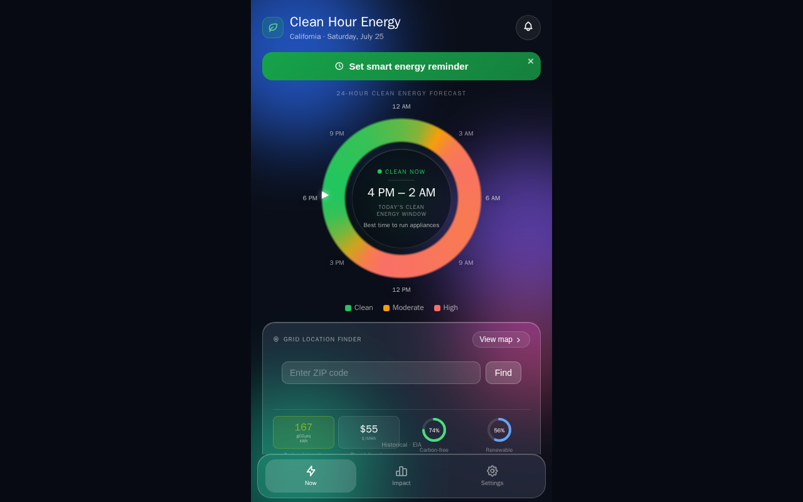

# Cycle 2 — Clean Hour

**Live:** [clean-hour.vercel.app](https://clean-hour.vercel.app)
**Code:** [github.com/Tatopapi3/clean-hour](https://github.com/Tatopapi3/clean-hour)

## Problem

Grid carbon intensity isn't constant — it swings hard by the hour, and the
swing is bigger than most people assume. California's grid can be **3.6×
cleaner at 1pm than at 7pm**, on the same day, through the same outlet. Solar
peaks at midday when demand is low; gas plants fire up in the evening when
everyone gets home. That mismatch between *when* the grid is clean and *when*
people actually use power is invisible unless someone shows it to you.

## Solution

Clean Hour tells you whether carbon-aware energy use is worth it where you
live, and by how much — combining real-time grid carbon intensity **and**
electricity pricing across three major U.S. grids into one plain verdict on
a 24-hour clock.

## Key features

- **Multi-region support** — California (CAISO), Texas (ERCOT), New York
  (NYISO), each with its own live data.
- **Combined carbon + price verdict** — not just "is the grid clean," but is
  it clean *and* worth it, crossing carbon intensity and price into signals
  like `both_worth_it` or `both_skip`.
- **24-hour clock visualization** — clean/moderate/high windows at a glance,
  with a live current-time marker.
- **ZIP code lookup + interactive map** — enter any ZIP for instant local
  status, or explore an Electricity-Maps-style colored region overlay.
- **Installable PWA with push notifications** — alerts when today's clean
  energy window opens, works offline via service worker.

## Tech stack

- Python data pipeline (EIA Open Data API, `gridstatus` for real-time
  LMP/SPP pricing) — fetches, then computes hourly carbon/price verdicts
- Electricity Maps API for live carbon intensity, with an EIA-backed
  fallback so the app always returns real data
- Vercel serverless function (`api/grid.js`) serving the frontend
- GitHub Actions running the full data pipeline hourly, auto-redeploying via Vercel
- Static PWA frontend with a service worker for offline support

---

Built at Pursuit L2 · Cycle 2, with Antonin Lesov and Bertrand Cius.
